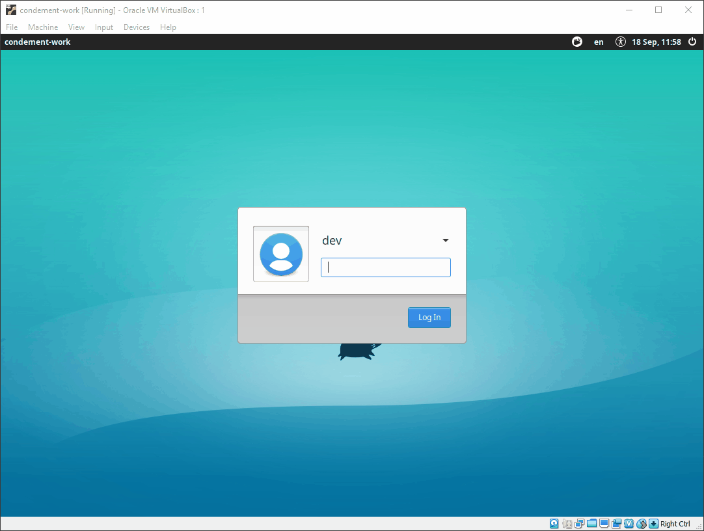

# Condement

Condement (or **Con**tainer **De**velopment Environ**ment**) is intended as a simple way to get a development
environment for containers.

This project was started due to various issues encountered while trying to develop Linux containers using Windows host.
The project aims to provide a stable, easy to use development environment for Linux containers, allowing developers to
spend more time developing and less time setting up and maintaining their environments.

## The Result

The environment can be configured with a simple yaml file but generally consists of:

* Ubuntu 18.04 (LTS) with either a Xubuntu or Lubuntu desktop environment.
* A 'dev' user with sudo (password: 'condement')
* Files persisted to your host machine
* Various software packages:
  * Container Hosting
    * [Docker](https://www.docker.com/)
    * [Kubernetes](https://kubernetes.io/) (via [k3s](http://k3s.io))
      * [Kubernetes Dashboard](https://kubernetes.io/docs/tasks/access-application-cluster/web-ui-dashboard/)
  * Developer Tools
    * [Visual Studio Code](https://code.visualstudio.com/)
    * [Azure Data Studio](https://docs.microsoft.com/en-us/sql/azure-data-studio/what-is?view=sql-server-2017)
  * Browsers
    * [Firefox](https://www.mozilla.org/en-US/firefox/new/)
    * [Chromium](https://www.chromium.org/Home)

## Further Documentation

* [Getting Started](./docs/getting-started.md)
* [Configuration](./docs/configuration/)
* [Software Packages](./docs/software/)
* [Using the VM](./docs/using-the-vm.md)
* [Using multiple VMs](./docs/using-multiple-vms.md)
