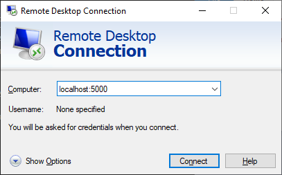
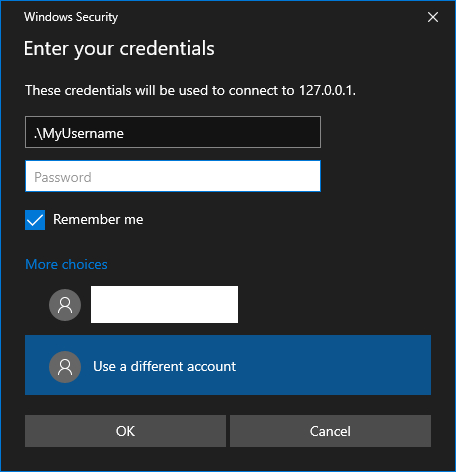
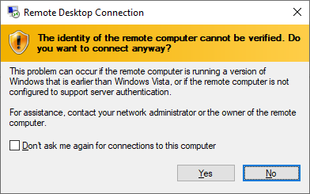
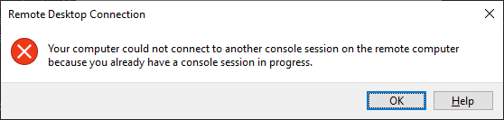

# Connecting via Remote Desktop

## Introduction

The VirtualBox user interface provides the ability to connect to the desktop of a Virtual Machine (VM), however, there
are some annoyances with using this. As an alternative, VirtualBox and Condement allow the use of a Remote Desktop
Connection to interact with the VM.

The instructions below show how to connect the Remote Desktop client built in to Windows, however, clients are also
available for Linux, Mac and even mobile platforms. Provided that the client supports the Microsoft RDP protocol, it
should work with Condement.

> ⚠ The default settings in VirtualBox expose the desktop so that anyone on the network can connect without connection
> details. In order to better secure the environment, Condement will default to enabling the "External" authentication
> type. This requires that a username and password of the host machine be entered in order to connect.

## Connecting to the VM

1. Ensure that the `rdp_port` settings is defined in the Condement configuration file and that the VM has been rebuilt.
2. Open "Remote Desktop Connection" from the start menu.
3. Enter `localhost:<rdp_port>` into the computer name field, replacing `<rdp_port>` with the port number from the
   Condement configuration file.

   
4. Click "Show options" and ensure the "Allow me to save credentials" checkbox is selected (this only needs to be done
   once).
5. Click connect.
6. If prompted for credentials, be sure to click "More choices" and select "Use a different account". Then enter the
   username of your account on the host machine in the format `.\<username>` and the password for your account.

   
7. If you receive the following warning, click "Yes". This is caused by VirtualBox using an older version
   of the RDP protocol and is usual when connecting to a non-Windows Operating System.

   

You should now be connected to the Condement VM and can login and interact with it as usual.

## Troubleshooting

### The connection fails or is already in use

A connection failure is unlikely given we are connecting to the current machine. Instead, a connection failure will
usually mean that VirtualBox could not start the service on the specified port. This is usually because it is already in
use. To resolve this, simply change the port number to an unused port. To avoid rebuilding the VM, this can be done in
the VirtualBox settings in the "Display" page under the "Remote Desktop" tab. When using this method, ensure you select
"External" authentication. Otherwise your VM will be accessible to anyone on the network.
